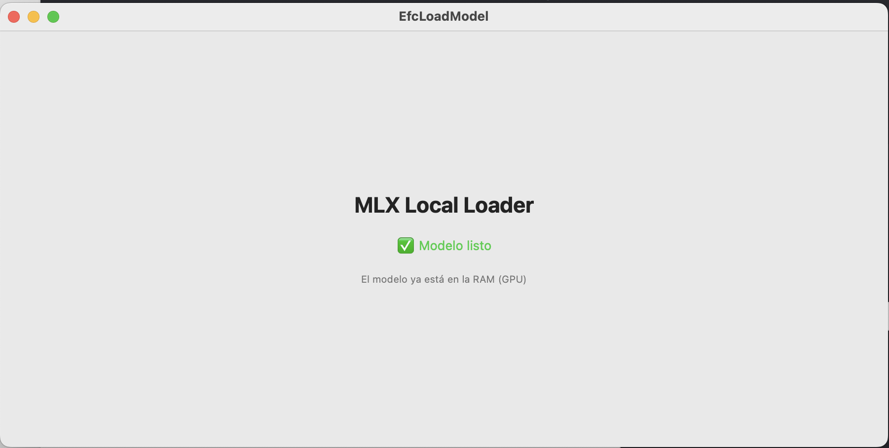
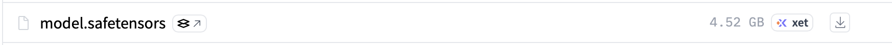

# MLX Local LLM Loader (Swift) 🚀

Este proyecto demuestra cómo integrar y cargar modelos de lenguaje de gran tamaño (LLM) de forma local en aplicaciones macOS/iOS utilizando el framework **MLX Swift** de Apple.

El objetivo principal es permitir la ejecución de modelos potentes como **Llama 3.1 8B** directamente en el dispositivo, garantizando privacidad, baja latencia y aprovechando al máximo la Memoria Unificada de los chips Apple Silicon (M1/M2/M3/M4).

<p align="center">
  
</p>

### ✨ Características clave

* **Carga Local Directa:** Configuración optimizada para leer modelos desde el Bundle de la aplicación o rutas locales.
* **Gestión de Memoria Unificada:** Implementación eficiente que utiliza **LanguageModel** y **ModelContext** de MLX.
* **Asincronía y Concurrencia:** Uso de **Swift Concurrency** (async/await) para evitar bloqueos en la interfaz durante la carga de pesos pesados.
* **Feedback en Tiempo Real:** Seguimiento preciso del progreso de carga de los archivos **.safetensors**.

***


### 🛠️ Requisitos Técnicos

* **Software:** Xcode 16+ / Swift 6.0 (Soporte **@Observable**).
* **Librerías MLX:** MLX, MLXLM, MLXLMCommon, Tokenizers.

***

### 🚀 Guía de Configuración Rápida

#### 1. Preparación del Modelo
Es crucial utilizar archivos binarios reales. Si los archivos se descargan mediante Git LFS de forma incorrecta, el cargador fallará.
* **Validación:** El archivo **model.safetensors** debe pesar aproximadamente **4.65 GB**.
* **Localización de Recursos:** Para que **Bundle.main.url** localice correctamente el directorio del modelo, la carpeta debe añadirse a Xcode como **"Folder Reference"** (color **AZUL**). Si se añade como grupo (amarillo), la ruta devolverá **nil** y el modelo no podrá inicializarse.

Es fundamental descargar los archivos binarios correctos desde el repositorio oficial:
* **Descarga:** [Meta-Llama-3.1-8B-Instruct-4bit en Hugging Face](https://huggingface.co/mlx-community/Meta-Llama-3.1-8B-Instruct-4bit/tree/main)

***


#### 2. Implementación del Loader
El corazón del proyecto es el **LLMManager**, que permite alternar entre diferentes configuraciones:

```swift
import Foundation
import MLX
import MLXLLM
import Tokenizers
import MLXLMCommon

@Observable
@MainActor
class LLMManager {
    var model: (any LanguageModel)? = nil
    var tokenizer: (any Tokenizer)? = nil
  
    var isModelLoaded = false
    var statusText = "Esperando..."
    var loadProgress: Double = 0

    func loadModel() async {
        statusText = "Localizando modelo..."
        
        guard let modelURL = Bundle.main.url(forResource: "Meta-Llama-3.1-8B-Instruct-4bit", withExtension: nil) else {
            self.statusText = "❌ Carpeta no encontrada"
            return
        }

        do {
            statusText = "Cargando pesos..."
            
            let config = MLXLMCommon.ModelConfiguration(directory: modelURL)

            let context = try await LLMModelFactory.shared.load(configuration: config) { progress in
                Task { @MainActor in
                    self.loadProgress = progress.fractionCompleted
                }
            }

            self.model = context.model
            self.tokenizer = context.tokenizer
            
            self.isModelLoaded = true
            self.statusText = "✅ Modelo listo"
            
        } catch {
            self.statusText = "❌ Error: \(error.localizedDescription)"
            print(error)
        }
    }
}
```

#### 2. View
UI:

```swift
import SwiftUI

struct ContentView: View {
    @State private var manager = LLMManager()

    var body: some View {
        VStack(spacing: 20) {
            Text("MLX Local Loader")
                .font(.title).bold()

            Text(manager.statusText)
                .foregroundColor(manager.isModelLoaded ? .green : .primary)
            
            if !manager.isModelLoaded {
                ProgressView(value: manager.loadProgress) {
                    Text("\(Int(manager.loadProgress * 100))%")
                }
                .padding()
                
                Button("Cargar Modelo") {
                    Task {
                        await manager.loadModel()
                    }
                }
                .buttonStyle(.borderedProminent)
            } else {
                Text("El modelo ya está en la RAM (GPU)")
                    .font(.caption)
                    .foregroundStyle(.secondary)
            }
        }
        .padding()
        .frame(width: 400, height: 300)
    }
}

```

***

### ⚠️ Lecciones Aprendidas (Troubleshooting)

<p align="center">
  
</p>


**Problema Detectado: Error "Invalid json header length"**

Este error es el obstáculo más común. Indica que el sistema intentó leer los pesos del modelo pero encontró un archivo de texto de **Git LFS** (un "puntero"). MLX espera un encabezado binario y, al recibir texto plano, la longitud es inválida.

**Pasos para la solución definitiva:**

1. **Validar el tamaño físico:** Entra en el Finder y comprueba que los archivos **.safetensors** pesen Gigabytes (GB) y no Kilobytes (KB).
2. **Verificar el Target Membership:** En Xcode, asegúrate de que la carpeta azul esté marcada en la sección **Copy Bundle Resources** dentro de **Build Phases**.
3. **Limpiar la compilación:** Es vital realizar un **Clean Build Folder** (Cmd + Shift + K) para eliminar cualquier rastro de archivos corruptos que Xcode haya guardado en la carpeta **DerivedData**.

***
